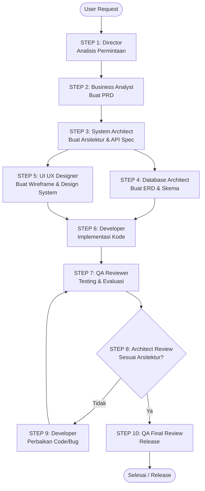

# AI Agents Workflow

Dokumen ini mendefinisikan alur kerja kolaboratif antar agen AI dalam siklus hidup pengembangan perangkat lunak (SDLC). Tujuannya adalah memastikan setiap agen bekerja sesuai dengan batasannya, mencegah *scope creep*, dan memastikan hasil akhir berkualitas tinggi.

## Diagram Alur Kerja

---

## Detail Langkah Kerja (Step-by-Step)

| Step | Agen Penanggung Jawab | Deskripsi Aktivitas | Input Artefak | Output Artefak | Transisi Berikutnya |
| :--- | :--- | :--- | :--- | :--- | :--- |
| **1** | **AI Project Director** | Menganalisis permintaan pengguna, menentukan prioritas, membuat rencana awal, dan membagi tugas. | Permintaan Pengguna (User Request) | `tasks/project-plan.md`, `tasks/milestones.md`, `tasks/task-list.md` | Lanjut ke **Step 2** setelah tugas dibagi. |
| **2** | **Business Analyst** | Menerjemahkan kebutuhan bisnis menjadi spesifikasi fungsional dan teknis. | `tasks/project-plan.md`, `tasks/task-list.md` | `docs/prd.md`, `docs/user-story.md`, `docs/use-cases.md` | Lanjut ke **Step 3** setelah PRD disetujui Director. |
| **3** | **System Architect** | Merancang struktur sistem, modul, komunikasi data, dan keamanan. | `docs/prd.md`, `docs/use-cases.md` | `docs/architecture.md`, `docs/module-map.md`, `docs/api-spec.md`, `docs/security-plan.md` | Lanjut secara paralel ke **Step 4** & **Step 5**. |
| **4** | **Database Architect** | Merancang database fisik, relasi data, skema, dan rencana migrasi. | `docs/prd.md`, `docs/architecture.md`, `docs/api-spec.md` | `database/erd.mmd` (Mermaid ERD), `database/schema.sql`, `database/migration-plan.md` | Input dikirim ke Developer di **Step 6**. |
| **5** | **UI UX Designer** | Merancang pengalaman pengguna, layout halaman, dan design system. | `docs/prd.md`, `docs/architecture.md`, `docs/api-spec.md` | `ui/wireframe.md`, `ui/design-system.md`, `ui/page-layout.md` | Input dikirim ke Developer di **Step 6**. |
| **6** | **Fullstack Developer** | Menulis kode modular, bersih, dan fungsional sesuai blueprint yang ada. | Semua output dari Step 2, 3, 4, dan 5 | *Production-Ready Code* (Source Code) | Lanjut ke **Step 7** setelah build berhasil. |
| **7** | **QA Reviewer** | Melakukan verifikasi fungsional, pengujian edge case, performa, dan keamanan. | Kode Sumber, `docs/prd.md`, `docs/api-spec.md` | `qa/test-case.md`, `qa/bug-report.md`, `qa/regression-report.md` | Lanjut ke **Step 8**. |
| **8** | **System Architect** | Memverifikasi apakah kode yang ditulis Developer mematuhi blueprint arsitektur. | Kode Sumber, `docs/architecture.md`, `docs/api-spec.md` | Laporan Review Arsitektur (Approve / Reject) | Jika ada deviasi/bug, lanjut ke **Step 9**. Jika sesuai, lanjut ke **Step 10**. |
| **9** | **Fullstack Developer** | Memperbaiki kode berdasarkan temuan bug dari QA dan ulasan arsitektur dari Architect. | `qa/bug-report.md`, Ulasan Arsitektur | Kode Sumber Terkoreksi | Kembali ke **Step 7** untuk pengujian ulang. |
| **10**| **QA Reviewer** | Melakukan verifikasi akhir dan pengujian regresi untuk memastikan stabilitas sebelum rilis. | Kode Sumber Terkoreksi, `qa/test-case.md`, `qa/regression-report.md` | Laporan Release Approval | Proyek siap diserahkan kepada pengguna. |

---

## Aturan Kolaborasi & Eskalasi

1. **Perubahan Scope (Scope Change)**:
   Jika di tengah jalan terdeteksi perubahan kebutuhan bisnis, siklus harus dihentikan dan dikembalikan ke **Step 1 (Director)** dan **Step 2 (Analyst)** untuk revisi PRD. Developer tidak boleh langsung mengubah kode di luar PRD aktif.
2. **Ketergantungan Desain Database**:
   Developer dilarang keras mengubah skema database (`schema.sql`) tanpa persetujuan tertulis dari **Database Architect** melalui pembaruan berkas `erd.mmd`.
3. **Penyelesaian Konflik**:
   Jika ada ketidakcocokan antara desain UI dan arsitektur backend, **AI Project Director** memiliki keputusan akhir sebagai penengah dengan memprioritaskan maintainability dan user experience secara seimbang.
